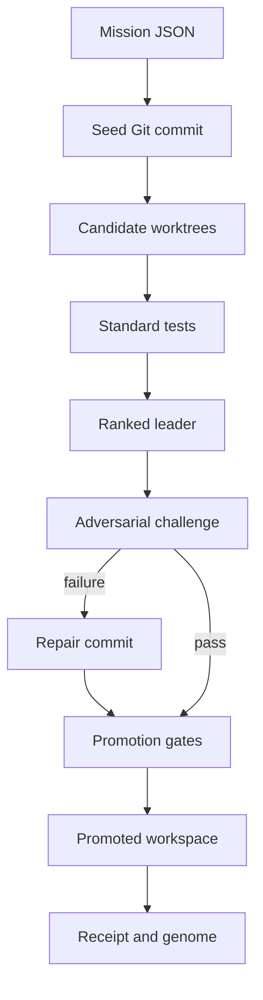

# Architecture

## P0 execution flow

## Components

- **Mission loader:** validates declarative mission boundaries.
- **Worktree forge:** captures one seed and creates isolated candidate branches/worktrees.
- **Operation engine:** applies contained write, replace, and delete operations.
- **Executor:** runs commands without a shell and records exit code, output, and duration.
- **Arbiter:** ranks standard-gate survivors using deterministic scores.
- **Adversarial gate:** executes a distinct challenge suite against the leader.
- **Repair path:** applies explicit corrective operations and re-runs every gate.
- **Proof emitter:** hashes promoted files and canonical receipt data.
- **Capability genome:** records demonstrated capabilities and their evidence hash.

## Trust boundary

Mission commands execute with the permissions of the invoking user. The P0 worktree boundary protects project lineage, not the host operating system. Production-grade process isolation is a later hardening requirement.

## Adapter direction

Later phases add model-backed candidate generators, stronger sandbox backends, EDEN/Cali execution, Thoth memory, ProofGrid publication, and ServerForge Gateway observability behind stable interfaces. The ServerForge HTTP bridge for plan, preflight, snapshot, apply, and verify is already inside the executable P0 baseline.
