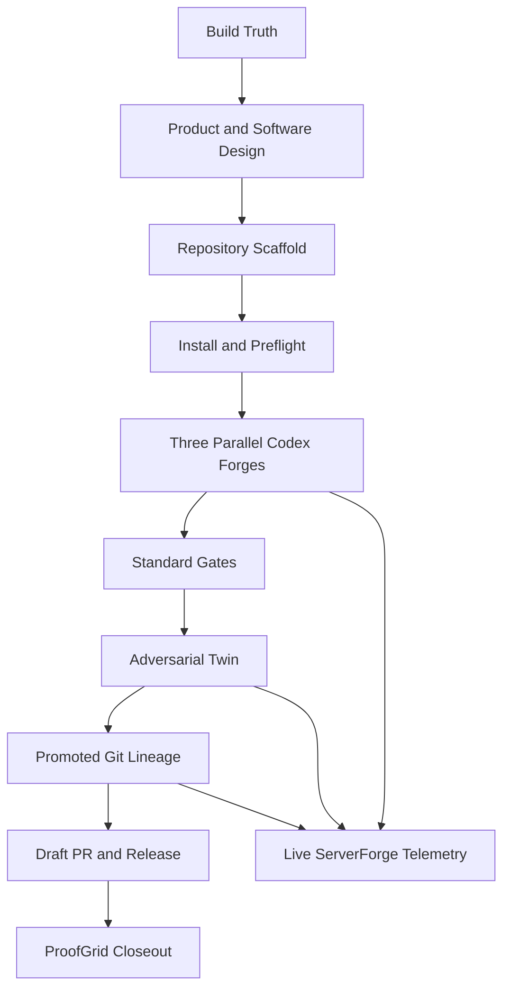

# PROMETHEUS V-1.1.1 Full Campaign

This is the single design-to-install path. It starts from the original build-truth files, builds the recursive runtime, runs the competing Codex lanes, promotes one branch, publishes the live case study during execution, and ends with install/release proof.

## Campaign topology



## Phase 00 — Source-truth freeze

Inputs:

- `docs/BUILD_TRUTH.md`
- `docs/PRODUCT_REQUIREMENTS.md`
- `docs/REFERENCE_ARCHITECTURE.md`
- `docs/OFFICE_200.md`
- `docs/PROOF_SCHEMA.md`
- `docs/THREAT_MODEL.md`
- `docs/HYDRA_SERVERFORGE_CAMPAIGN.md`
- `proof/SERVERFORGE_LIVE_VERIFICATION.md`

Gate: the Git worktree is clean and the base commit is captured before any candidate is created.

## Phase 01 — Product and software design

The frozen recursive mission defines objective, acceptance criteria, constraints, tests, three materially different strategies, repository target, base branch, and promotion branch prefix. Candidate prompts inherit this common contract and add only their strategy-specific direction.

Gate: `missions/self-build.json` validates and names at least three unique candidates.

## Phase 02 — Scaffold and install

`scripts/Install-Prometheus.ps1` creates `.venv`, installs the package in editable mode, executes the test suite, and writes `PROMETHEUS.ps1` as the local launcher. The installer never embeds Discord or GitHub credentials.

Gate: the installed interpreter passes the complete unit suite.

## Phase 03 — External preflight

The full runner requires:

- Python 3.11+
- Git
- authenticated Codex CLI
- authenticated GitHub CLI for draft-PR publication
- exact repository confirmation
- live Discord guild ID and bot token for simultaneous ServerForge publication

The existing ServerForge topology is verified before the recursive campaign begins. The bot token remains only in the parent PromptShell environment and is removed from every Codex child environment.

## Phase 04 — Everything everywhere: parallel forge

PROMETHEUS creates three branches and worktrees from one base commit, then runs the Codex candidate lanes concurrently:

1. `reliability-spine`
2. `security-boundary`
3. `operator-velocity`

Each lane receives the same frozen objective, gates, constraints, and repository state. Each lane may inspect, edit, document, and test only its own worktree. It may not push or open a PR.

ServerForge receives mission acceptance and candidate lifecycle events while the three local lanes run.

## Phase 05 — Standard arbitration

Each candidate patch is committed and tested independently. Candidates with no changes, too many changed files, a failed Codex execution, or a failed standard command are ineligible. The deterministic score selects among passing candidates only.

Gate: at least one passing candidate and exactly one selected leader.

## Phase 06 — Adversarial Twin

A separate Codex execution inspects the leader’s actual diff for incomplete requirements, unsafe boundaries, credential leakage, brittle tests, non-idempotent behavior, and platform incompatibilities. Proven repairs are committed, then both standard and adversarial commands run again.

Gate: both post-challenge commands pass.

## Phase 07 — Proof and promotion

PROMETHEUS hashes the promoted source, Codex evidence files, frozen mission, candidate results, and hash-chained ledger. It commits:

- `proof/recursive/<run-id>/mission.json`
- `proof/recursive/<run-id>/candidate-results.json`
- `proof/recursive/<run-id>/codex-evidence.json`
- `proof/recursive/<run-id>/events.jsonl`
- `proof/recursive/<run-id>/promotion-receipt.json`
- `proof/recursive/<run-id>/capability-genome.json`

Gate: `prometheus verify-recursive` returns `valid: true`.

## Phase 08 — GitHub and release body

Only the promoted lineage is pushed, and only when `--confirm-repo` exactly matches the mission repository. GitHub CLI opens a draft PR against `main`. `scripts/Build-PrometheusRelease.ps1` builds the wheel and writes `dist/release-manifest.json` with SHA-256 hashes.

Gate: pushed branch, draft PR URL, wheel, and release manifest are present.

## Phase 09 — ServerForge closeout

During the campaign, bounded messages route to mission intake, candidate forge, promotion gate, challenge queue, findings, repair verification, promotion receipts, and telemetry. The closeout message publishes the run ID, leader, receipt hash, and promotion branch.

Gate: local publication ledger exists; when live mode is enabled, every publication records its Discord channel and message ID.

## One-command operator path

From Janus Prime PromptShell:

```powershell
Set-Location 'C:\Ghost\PROMETHEUS-V-1.1.1'

& '.\scripts\Run-PrometheusFullCampaign.ps1' `
    -ConfirmRepo 'Atlas-Ascend/PROMETHEUS-V-1.1.1' `
    -ConfirmGuild $env:DISCORD_GUILD_ID
```

The script installs, tests, verifies ServerForge, runs the recursive Codex campaign, pushes the promoted branch, opens the draft PR, verifies the recursive receipt, builds the wheel, and prints one closeout block.

## Recovery law

- Candidate failure does not stop other independent lanes.
- No viable candidate means no promotion.
- Challenge failure means no promotion.
- Repository or guild confirmation mismatch blocks before the corresponding external action.
- A failed push leaves the promoted local branch and proof bundle intact for retry.
- A failed Discord publication does not erase local campaign evidence; it remains a visible campaign failure that must be repaired before a live closeout claim.
