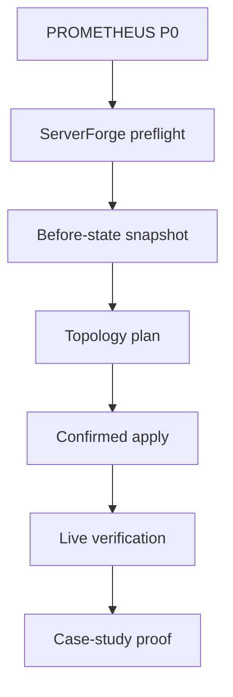
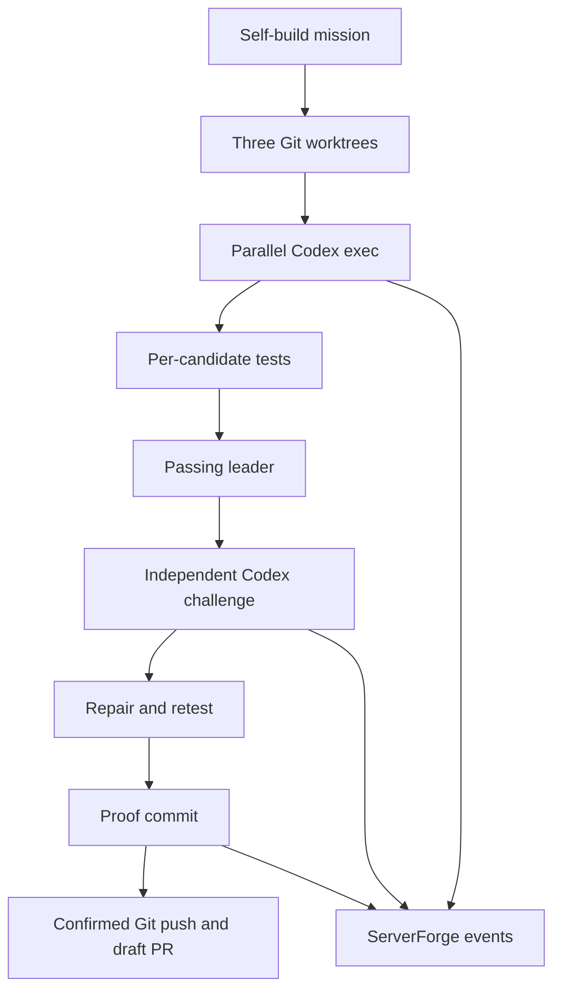

# Reference Architecture

PROMETHEUS separates decision, execution, and evidence so no candidate can silently promote itself and no polished narrative can replace proof.

## Four planes

### Mission plane

Mission intake defines objective, constraints, candidates, tests, policy, and acceptance gates. The mission file is frozen and hashed at run start.

### Forge plane

The Counterfactual Forge creates independent candidate branches and Git worktrees from one captured seed. Candidate operations are deterministic in P0; model-backed and human-authored generators can later implement the same port.

### Execution plane

Executors run bounded commands with allowlisted executables, timeouts, output limits, isolated working directories, and recorded exit evidence. P0 isolates repository state with Git worktrees. Container, VM, and EDEN/Cali sandboxes are future backends.

### Proof plane

The arbiter selects only among standard-gate survivors. The leader must pass a distinct adversarial gate. Repairs become commits. Promotion emits a portable artifact manifest, canonical receipt hash, capability genome, and append-only hash-chained event ledger.

## Direct ServerForge bridge

ServerForge is an execution adapter active at startup:

The bridge is additive and idempotent by default: it creates missing named resources and does not delete unrelated Discord content. Every live apply requires an exact guild-ID confirmation and captures a backup first.

## Target ports

| Port | P0 implementation | Expansion path |
|---|---|---|
| Candidate generator | Declarative file operations | Codex/local-model/human adapters |
| Workspace | Git worktrees | containers, microVMs, remote workers |
| Executor | direct subprocess with policy | EDEN/Cali workers and resource quotas |
| Evaluator | command gates and deterministic score | rubric ensembles and benchmark services |
| Challenger | independent command suite | Adversarial Twin agent and chaos backends |
| Memory | run directory and ledger | Thoth event store and retrieval |
| Proof | SHA-256 receipt/genome | signed attestations and ProofGrid publication |
| External surface | Discord HTTP API v10 | ServerForge Gateway events and observatory |

## Recursive execution plane

P1 implements the model-backed candidate-generator port without changing P0:

`CodexProvider` owns non-interactive model execution and transcript capture. `run_recursive_campaign` owns worktrees, concurrency, gates, arbitration, evidence, and promotion. `CaseStudyPublisher` maps bounded lifecycle events to the existing ServerForge topology. PowerShell scripts own Windows installation, authenticated operator preflight, release packaging, and the one-command campaign.

## State model

`ACCEPTED → FORGING → TESTING → CHALLENGING → REPAIRING? → PROMOTED | FAILED`

Every transition becomes a ledger event. Terminal promotion requires exactly one candidate with passing standard and adversarial evidence.

## Failure semantics

- No standard-gate survivor: mission fails without promotion.
- Challenge failure without a repair plan: mission fails.
- Post-repair test failure: mission fails.
- Receipt mismatch: verification fails nonzero.
- Discord credential/guild mismatch: bridge blocks before mutation.
- Discord topology mismatch after apply: bridge returns `VERIFY_FAILED`.
